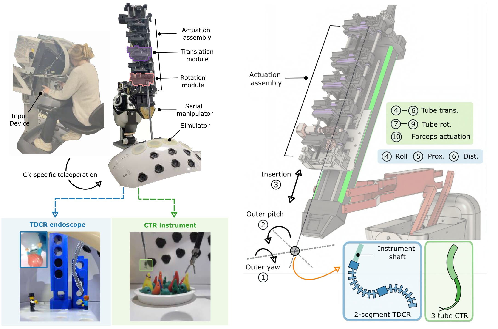
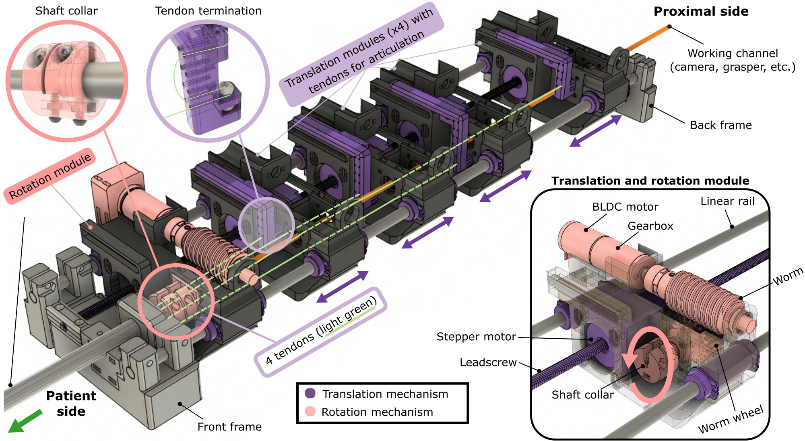

<h1 align="center">A Unified Continuum Robot Actuation Platform - Hardware</h1>

  Open-source hardware to help researchers get started with high-DOF robots. 
  We focus on continuum robots, but the platform is agnostic to robot type!

  <a href="https://ucsdmorimotolab.github.io/unified-actuation/"><b>Project website</b></a>
  &nbsp;·&nbsp;
  <a href="https://drive.google.com/file/d/1_eJ_vQgiMd1IlGs77tz4AiUZTHAcJVn4/view"><b>Full actuation assembly video</b></a>
  &nbsp;·&nbsp;
  <a href="https://github.com/UCSDMorimotoLab/unified-actuation-software"><b>Looking for software?</b></a>

---

## What's in this repo

| | |
|---|---|
| [Assembly guide](AssemblyDoc_6-24-2026.pdf) | Step-by-step mechanical assembly instructions (PDF) |
| [Bill of materials](BOM_6-25-2026.xlsx) | Parts list for the actuation system (Excel) |
| [CAD and print files](CAD_and_print_files/) | SolidWorks assemblies and 3D-print files |

The [full actuation assembly video](https://drive.google.com/file/d/1_eJ_vQgiMd1IlGs77tz4AiUZTHAcJVn4/view) walks through the complete build alongside the assembly guide.

## System overview

  

## Design overview

  

  <em>An example actuation assembly for a TDCR. Modules can be reconfigured to match the robot's design and number of DOFs. A central working channel accommodates cameras, forceps, and other tools.</em>

